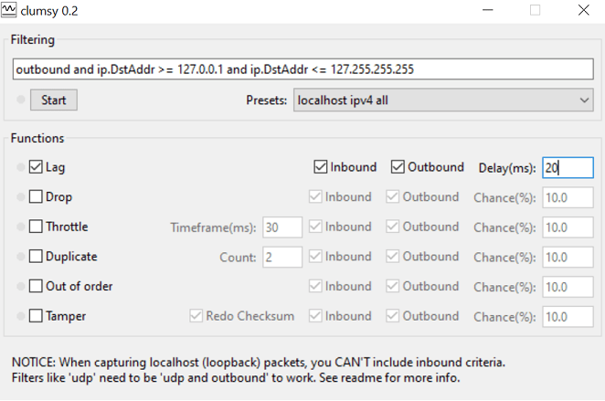

#### Introduction

When considering or analysing a migration to the cloud, it is often the case that you will need to make some decisions around which applications/services you will move and in which order.

This can start to get a little challenging if you have some legacy line of business applications which are possibly dependent on a client application being "next to" an application or database server/can only cope with certain latency. The most challenging are when "nobody really knows" if an application has latency dependencies or not!

#### Example Scenario

Here is an example scenario I've been presented with a number of times.

- I have a legacy line of business application which may (or may not!) perform poorly with higher network latency and a bunch of users with traditional Windows desktops. "This is how it's always been".

- My users have always had their desktop "next to" the application server - so low latency and high performance but I want to move my users to cloud VDI such as Windows Virtual Desktop and I am worried about impacting them.

- I may also want to migrate my servers to Azure but I'm not sure if I want to migrate everything piece by piece, I don't want to or can't migrate everything at once (ala "big bang").

#### Assessment - Clumsy

So how do we assess performance of an application particularly in say an interim state whereby we have moved the application's servers to the cloud but the users desktop is still on prem?

Well before we even migrate a server or spin up a virtual network, we can use tools such as <a href="http://jagt.github.io/clumsy/index.html" target="_blank">Clumsy</a> to help here.

Using <a href="http://jagt.github.io/clumsy/index.html" target="_blank">Clumsy</a> we can test in the organisations existing environment with the application server and desktop on a local LAN but artificially inflating factors such as latency over a VPN or Expressroute to see how the application behaves.

This is really easy to get going!

1. <a href="http://jagt.github.io/clumsy/download.html" target="_blank">Download Clumsy</a>

2. Run Clumsy on a test desktop (assuming you download precompiled release just double click the exe)

3. Adjust parameters such as latency and test your application to see how it performs!

There is more information if you have problems or want to get a little more advanced in the manual here - <a href="http://jagt.github.io/clumsy/manual.html" target="_blank">http://jagt.github.io/clumsy/manual.html</a>

--

I am taking part in the <a href="https://100daysofcloud.com/" target="_blank">#100DaysOfCloud Challenge</a>. Please do have a look at my <a href="https://github.com/rossinthecloud/100DaysOfCloud" target="_blank">Github journey tracker</a> to find out more, track my progress or get involved.

If you have any questions please also do reach out to me via a comment or on Twitter<a href="https://www.twitter.com/rossinthecloud" target="_blank"> @rossinthecloud</a>.

